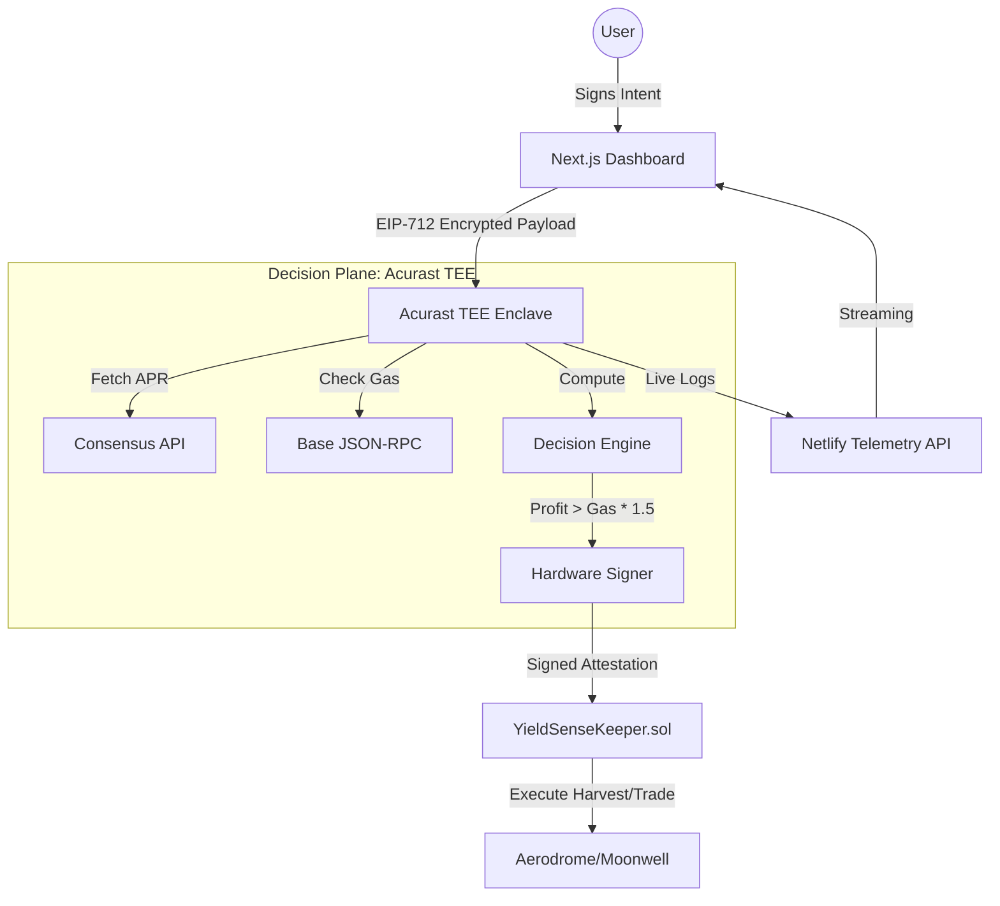

# YieldSense Technical Architecture

YieldSense is an autonomous, trust-minimized yield engine that bridges the gap between high-performance off-chain computation and secure on-chain execution using **Acurast Trusted Execution Environments (TEEs)**.

## System Overview

The architecture is divided into three distinct layers: the **User Interface (Control Plane)**, the **Acurast Enclave (Decision Plane)**, and the **EVM Smart Contracts (Settlement Plane)**.

---

## 1. Control Plane: Next.js Frontend
The frontend is the entry point for user capital and strategy parameterization.
- **Strategy Encryption**: User intents (stop-loss prices, grid boundaries, slippage) are not sent as plain text. Instead, they are signed via **EIP-712**, ensuring that only the authorized TEE worker can verify and act upon them.
- **Real-time Telemetry**: Connects to the `/api/state` sink to provide a live "Guardian Ledger" of every decision made by the autonomous agent.

## 2. Decision Plane: Acurast TEE Enclave
The "brain" of the protocol runs inside a hardware-isolated environment (ARM TrustZone / AWS Nitro).
- **Autonomous Decisioning**: The `Decision Engine` evaluates the profitability formula:
  `V * r * Δt * (1-τ) > Cgas * θ`
- **Isolation**: Key material is generated within the enclave via `getAcurastStd()`. The private key is never exposed to the developer or the host machine.
- **Data Freshness**: To prevent "Stale Price" attacks, the worker queries the Base RPC directly from within the enclave to verify gas and spot prices before signing.

## 3. Settlement Plane: Smart Contracts
The `YieldSenseKeeper.sol` acts as the final gatekeeper for vault funds.
- **Attestation Verification**: The contract uses the `Acurast P-256` signature verification module. It only accepts `executeHarvest` or `executeTrade` calls if the signature matches a whitelisted hardware processor.
- **Non-Custodial Logic**: The keeper is restricted to interacting only with authorized protocols (Aerodrome, Moonwell). It contains no logic to transfer principal funds to an external EOA.

---

## Execution Flow: The "Harvest" Lifecycle
1. **Trigger**: Every 60 seconds, the TEE worker wakes up.
2. **Scan**: It indexes the last 7 days of swap logs and reward emissions to calculate a "Robust Yield Estimate."
3. **Audit**: It checks the current L2 gas price.
4. **Decision**: If `Net Profit > Gas Cost * 1.5`, it moves to signing.
5. **Attestation**: The worker builds a `PayloadHash` containing the `aprBps`, `rewardUsd`, and `timestamp`. It signs this with its internal hardware key.
6. **Execution**: The signed blob is submitted to the `YieldSenseKeeper`. The contract verifies the TEE's identity and triggers the `compound()` function on the target pool.
